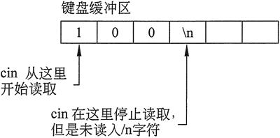

## ACM 输入输出

主要知识点是，在 C++ 中，可以使用 istringstream 配合 getline 根据分隔符来分割字符串。

### 字符串分割

首先，我们使用一个字符串s来初始化输入字符串流 istringstream

```c++
string s = "a/b/c/d";
istringstream iss(s);
```

然后，我们使用 getline 函数通过 iss 对字符串进行分割，getline 函数的原型为

```c++
istream& getline (istream &is , string &str , char delim);
```

第一个参数为 is 表示一个 istringstream，这里就是 iss，第二个参数表示我们要将字符串分割的结果通过 getline 逐个放入 str 中，第三个参数为分隔符，注意分隔符只能为字符型。示例如下：

```c++
#include <sstream>
#include <iostream>
#include <vector>
using namespace std;

int main()
{
    string s = "a/b/c/d";
    istringstream iss(s);
    string buffer;
    while(getline(iss, buffer, '/'))
    {
        cout<<buffer<<endl;
    }
    return 0;
}
```

输出为

```
a
b
c
d
```

如果我们将字符串 s 设为 a/b//c//d，代码其余不变，则结果为

```
a
b

c

d
```

可以看到，两个连续的分隔符会被解析为空串。

### while 和 cin 配合使用的解析

从输入缓存区读取数据时会跳过空格和回车，把他们当做字符之间的间隔。要想结束输入 ctrl+z 或者读到了文件末尾或者在 while 循环中添加条件语句跳出循环

```c++
#include <iostream>
using namespace std;

int main() {
  char c;
  cout << "enter a sentence:" << endl;
  while(cin >> c)
    cout << c;
  
  return 0;
}
```

原因是：

### C++ cin.get 用法

与字符串输入一样，有时候使用 cin>> 读取字符也不会按我们想要的结果行事。例如，因为它会忽略掉所有前导白色空格，所以使用 cin>> 就不可能仅输入一个空格或回车符。除非用户输入了空格键、制表符之外的其他字符，否则程序将不可能通过 cin 语句继续执行（一旦输入了这样的字符，在程序可以继续下一个语句之前，仍然需要按回车键）。因此，要求用户“按回车键继续”的程序，不能使用 >> 运算符只读取按回车键的行为。

在这些情况下，cin 对象有一个名为 get 的内置函数很有帮助。因为 get 函数是内置在 cin 对象中的，所以可称之为 cin 的一个成员函数。get 成员函数读取单个字符，包括任何白色空格字符。如果程序需要存储正在读取的字符，则可以通过以下任意一种方式调用 get 成员函数。

在这两个例子中，假设 cin 是正被读入字符的 char 变量的名称：

```c++
cin.get(ch);
ch = cin.get();
```

如果程序正在使用 get 函数简单地暂停屏幕直到按回车键，并且不需要存储字符，则该函数也可以这样调用:

.png)

请注意，在所有这 3 个编程语句中，get 函数调用的格式实际上是一样的。首先是对象的名称，在此示例中它是 cin。然后是一个句点，其后是被调用的成员函数的名称，在这里当然就是 get。语句的末尾是一组括号和一个表示结束的分号。这是调用任何成员函数的基本格式，如上图所示。 

下面的程序演示了使用 get 成员函数的所有 3 种方式： 

```c++
// This program demonstrates three ways to use cin.get()
// to pause a program.
#include <iostream>
using namespace std;
int main() {
  char ch;
  cout << "This program has paused. Press Enter to continue.";
  cin.get(ch);
  cout << "It has paused a second time. Please press Enter again."; 
  ch = cin.get();
  cout << "It has paused a third time. Please press Enter again.";
  cin.get();
  cout << "Thank you! \n";
  return 0;
}
```

**混合使用 cin>> 和 cin.get()**

先看下面的代码段示例：

```c++
char ch;    //定义一个字符变量
int number; //定义一个整型变量
cout << "Enter a number: ";
cin >> number;   // 读取整数
cout << "Enter a character: ";
ch = cin.get() ;   // 读取字符
cout << "Thank You!\n";
```

这些语句允许用户输入一个数字，而不是一个字符。看来第 6 行的 cin.get 语句已经被跳过了。这是因为 cin>> 和 cin.get 使用略有不同的技术来读取数据。

在示例代码段中，当执行第 4 行时，用户输入一个数字，然后按回车键。假设输入的是数字 100。按回车键会导致一个换行符('\n')存储在键盘缓冲区数字 100 之后，如下图所示。 



当第 4 行中的 cin>> 语句读取用户输入的数据时，它会在遇到换行符时停止。换行字符未被读取，而是仍保留在键盘缓冲区中。从键盘读取数据的输入语句只在键盘缓冲区为空时等待用户输入值，但现在不为空。

当第 6 行中的 cin.get 函数执行时，它开始从先前输入操作停止的键盘缓冲区读取，并发现了换行符，所以它无须等待用户输入另一个值，而直接输出换行符。这种问题最直接的解决办法是使用 cin.ignore 函数。
