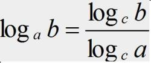

# algo_sum

个人记录

<!-- TOC -->

- [algo_sum](#algo_sum)
  - [C++ 基本数据类型](#c-基本数据类型)
    - [基本数据类型使用建议](#基本数据类型使用建议)
    - [C++ 中算数类型的数值范围](#c-中算数类型的数值范围)
  - [分析时间复杂度和空间复杂度](#分析时间复杂度和空间复杂度)
    - [大 O 复杂度表示法](#大-o-复杂度表示法)
    - [时间复杂度分析方法](#时间复杂度分析方法)
      - [1. 只关注循环执行次数最多的代码](#1-只关注循环执行次数最多的代码)
      - [2. 加法原则：总复杂度等于量级最大的那段代码的复杂度](#2-加法原则总复杂度等于量级最大的那段代码的复杂度)
      - [3. 乘法原则：嵌套代码的复杂度等于嵌套内外代码复杂度的乘积](#3-乘法原则嵌套代码的复杂度等于嵌套内外代码复杂度的乘积)
    - [几种常见时间复杂度分析实例](#几种常见时间复杂度分析实例)
      - [1. O(1)](#1-o1)
      - [2. O(n)](#2-on)
      - [3. O(logn)、O(nlogn)](#3-olognonlogn)
      - [4. O(m+n)、O(m*n)](#4-omnomn)
    - [空间复杂度分析](#空间复杂度分析)
    - [最好、最坏、平均、均摊时间复杂度](#最好最坏平均均摊时间复杂度)
      - [1. 最好情况时间复杂度](#1-最好情况时间复杂度)
      - [2. 最坏情况时间复杂度](#2-最坏情况时间复杂度)
      - [3. 平均情况时间复杂度](#3-平均情况时间复杂度)
      - [4. 均摊时间复杂度](#4-均摊时间复杂度)

<!-- /TOC -->

## C++ 基本数据类型

C++ 中的基本类型包括算数类型以及空类型。空类型不对应具体的值，算数类型包含字符，整数型，布尔值和浮点数。

算数类型又分为两类，整型（包括字符和布尔类型在内）和浮点型。

C++ 中的字符类型多数支持国际化（扩展字符集），基本的字符类型是 char，一个 char 的大小最小尺寸为一个机器字节。

C++ 中的整型有规定如下，一个 int 至少和一个 short 一样大，一个 long 至少和一个 int 一样大，一个 long long 至少和一个 long 一样大，long long 为 C++11 中新定义的。

除了布尔型和带扩展的字符型之外，其他整型可以分为带符号的和无符号的，在类型 int, short, long, long long 之前加上 unsigned 可以得到无符号类型（大于等于零），仅仅一个 unsigned 表示 unsigned int 的缩写。

需要注意的是，char 实际上分为了三种：char, unsigned char 和 signed char，尽管有三种类型，但是在实际使用时实际上只能表现出两种，所以，类型 char 具体的表现形式实际上由编译器决定。

C++ 中的浮点类型可以表示单精度、双精度和扩展精度值。在大多数编译器中，float 以 1 个字(4 个字节，32 bit)来表示，double 以 2 个字来表示，long double 以 3 个或者 4 个字表示。

> C++ 中的指针这种复合类型(区别于基本数据类型)大小为定值 4 个字节。

### 基本数据类型使用建议

- 当明确知道数据不为负时，选用无符号类型；
- 使用 int 来表示整型，当超出范围时，选用 long long;
- 在算数表达式中不要使用 char 和布尔类型，毕竟 char 在一些机器上是有符号的，但是在另外一些机器上是无符号的。除非指定 unsigned char 或者 signed char;
- 执行浮点数运算使用 double。

### C++ 中算数类型的数值范围

> 注意不同机器中的不同编译器数据类型的取值范围不一定相同

| Type | Size | 数值范围 |
| :------ | ------ | ------ |
| void | 0 byte | 无值域 |
| 布尔型 bool | 1 byte | true false |
| 有符号字符型 signed char | 1 byte | -128~127 |
| 无符号字符型 unsigned char | 1 byte | 0~255 |
| 有符号短整型 short / signed short | 2 byte | -32768~32767 |
| 无符号短整型 unsigned short | 2 byte | 0~65535 |
| 有符号整型 int / signed int | 4 byte | -2147483648~2147483647 |
| 无符号整型 unsigned int | 4 byte | 0~4294967295 |
| 有符号长整型 long / signed long | 4 byte | -2147483648~2147483647 |
| 无符号整型 unsigned long | 4 byte | 0~4294967295 |
| 有符号 long long / signed long long | 8 byte | -9223372036854775808 ~ +9223372036854775807 |
| 有符号 unsigned long long | 8 byte | 0~1844674407370955161 |

## 分析时间复杂度和空间复杂度

### 大 O 复杂度表示法

算法的执行效率，粗略地讲，就是算法代码执行的时间。但是，如何在不运行代码的情况下，用“肉眼”得到一段代码的执行时间呢？

```c++
int cal(int n) 
{ 
  int sum = 0; 
  int i = 1; 
  for (; i <= n; ++i) 
  { 
    sum = sum + i; 
  } 
  return sum; 
}
```

从 CPU 的角度来看，这段代码的每一行都执行着类似的操作：读数据-运算-写数据。尽管每行代码对应的 CPU 执行的个数、执行的时间都不一样，但是，我们这里只是粗略估计，所以可以假设每行代码执行的时间都一样，为 unit_time。在这个假设的基础之上，这段代码的总执行时间是多少呢？

第 3、4 行代码分别需要 1 个 unit_time 的执行时间，第 5、7 行都运行了 n 遍，所以需要 2n\*unit_time 的执行时间，所以这段代码总的执行时间就是 (2n+2)\*unit_time。可以看出来，所有代码的执行时间 T(n) 与每行代码的执行次数成正比。

按照这个思路，再来看这段代码：

```c++
int cal(int n) {
  int sum = 0;
  int i = 1;
  int j = 1;
  for (; i <= n; ++i) {
    j = 1;
    for (; j <= n; ++j) {
      sum = sum +  i * j;
    }
  }
}
```

依旧假设每个语句的执行时间是 unit_time，那么这段代码的总执行时间 T(n) 是多少呢？

第 2、3、4 行代码，每行都需要 1 个 unit_time 的执行时间，第 5、6 行代码循环执行了 n 遍，需要 2n \* unit_time 的执行时间，第 7、8 行代码循环执行了 n^2 遍，所以需要 2 \* n^2 * unit_time 的执行时间。所以整段代码的执行时间为 T(n) = (2 \* n^2 + 2 \* n + 3) \* unit_time。

尽管我们不知道 unit_time 的具体值，但是通过这两段代码执行时间的推导过程，我们可以得到一个非常重要的规律，那就是，所有代码的执行时间 T(n) 与每行代码的执行次数 n 成比例。我们可以把这个规律总结成一个公式：

**T(n) = O(f(n))**

其中，T(n) 我们已经讲过了，它表示代码执行的时间；n 表示数据规模的大小；f(n) 表示每行代码执行的次数总和。因为这是一个公式，所以用 f(n) 来表示。公式中的 O，表示代码的执行时间 T(n) 与 f(n) 表达式成正比。

所以，第一个例子中的 T(n) = O(2n+2)，第二个例子中的 T(n) = O(2n^2+2n+3)。这就是大 O 时间复杂度表示法。**大 O 时间复杂度实际上并不具体表示代码真正的执行时间，而是表示代码执行时间随数据规模增长的变化趋势**，所以，也叫作渐进时间复杂度（asymptotic time complexity），简称时间复杂度。

当 n 很大时，你可以把它想象成 10000、100000。而公式中的低阶、常量、系数三部分并不左右增长趋势，所以都可以忽略。我们只需要记录一个最大量级就可以了，如果用大 O 表示法表示刚讲的那两段代码的时间复杂度，就可以记为：T(n) = O(n)； T(n) = O(n^2)。

### 时间复杂度分析方法

#### 1. 只关注循环执行次数最多的代码

大 O 这种复杂度表示方法只是表示一种变化趋势。我们通常会忽略掉公式中的常量、低阶、系数，只需要记录一个最大阶的量级就可以了。所以，我们在分析一个算法、一段代码的时间复杂度的时候，也只关注循环执行次数最多的那一段代码就可以了。这段核心代码执行次数的 n 的量级，就是整段要分析代码的时间复杂度。

```c++
 int cal(int n) {
   int sum = 0;                //2
   int i = 1;                  //3
   for (; i <= n; ++i) {       //4
     sum = sum + i;            //5
   }
   return sum;
 }
```

其中第 2、3 行代码都是常量级的执行时间，与 n 的大小无关，所以对于复杂度并没有影响。循环执行次数最多的是第 4、5 行代码，所以这块代码要重点分析。前面我们也讲过，这两行代码被执行了 n 次，所以总的时间复杂度就是 O(n)。

#### 2. 加法原则：总复杂度等于量级最大的那段代码的复杂度

```c++
int cal(int n) {
   int sum_1 = 0;              
   int p = 1;                  
   for (; p < 100; ++p) {
     sum_1 = sum_1 + p;
   }

   int sum_2 = 0;
   int q = 1;
   for (; q < n; ++q) {
     sum_2 = sum_2 + q;
   }
 
   int sum_3 = 0;
   int i = 1;
   int j = 1;
   for (; i <= n; ++i) {
     j = 1; 
     for (; j <= n; ++j) {
       sum_3 = sum_3 +  i * j;
     }
   }
 
   return sum_1 + sum_2 + sum_3;
 }

```

这个代码分为三部分，分别是求 sum_1、sum_2、sum_3。我们可以分别分析每一部分的时间复杂度，然后把它们放到一块儿，再取一个量级最大的作为整段代码的复杂度。

第一段的时间复杂度是多少呢？这段代码循环执行了 100 次，所以是一个常量的执行时间，跟 n 的规模无关。

这里我要再强调一下，即便这段代码循环 10000 次、100000 次，只要是一个已知的数，跟 n 无关，照样也是常量级的执行时间。当 n 无限大的时候，就可以忽略。尽管对代码的执行时间会有很大影响，但是回到时间复杂度的概念来说，它表示的是一个算法执行效率与数据规模增长的变化趋势，所以不管常量的执行时间多大，我们都可以忽略掉。因为它本身对增长趋势并没有影响。

第二段代码和第三段代码的时间复杂度分别是 O(n) 和 O(n^2)。

综合这三段代码的时间复杂度，我们取其中最大的量级。所以，整段代码的时间复杂度就为 O(n2)。也就是说：总的时间复杂度就等于量级最大的那段代码的时间复杂度。那我们将这个规律抽象成公式就是：

如果 T1(n)=O(f(n))，T2(n)=O(g(n))；那么 T(n)=T1(n)+T2(n)=max(O(f(n)), O(g(n))) =O(max(f(n), g(n)))

#### 3. 乘法原则：嵌套代码的复杂度等于嵌套内外代码复杂度的乘积

我刚讲了一个复杂度分析中的加法法则，这儿还有一个乘法法则。类比一下，你应该能“猜到”公式是什么样子的吧？

如果 T1(n)=O(f(n))，T2(n)=O(g(n))；那么 T(n)=T1(n)T2(n)=O(f(n))O(g(n))=O(f(n)*g(n)).

也就是说，假设 T1(n) = O(n)，T2(n) = O(n^2)，则 T1(n) * T2(n) = O(n^3)。落实到具体的代码上，我们可以把乘法法则看成是嵌套循环，我举个例子解释一下。

```c++
int cal(int n) {
   int ret = 0; 
   int i = 1;
   for (; i < n; ++i) {
     ret = ret + f(i);
   } 
 } 
 
 int f(int n) {
  int sum = 0;
  int i = 1;
  for (; i < n; ++i) {
    sum = sum + i;
  } 
  return sum;
 }
```

我们单独看 cal() 函数。假设 f() 只是一个普通的操作，那第 4、6 行的时间复杂度就是，T1(n) = O(n)。但 f() 函数本身不是一个简单的操作，它的时间复杂度是 T2(n) = O(n)，所以，整个 cal() 函数的时间复杂度就是，T(n) = T1(n) * T2(n) = O(n*n) = O(n^2)。

### 几种常见时间复杂度分析实例


对于刚罗列的复杂度量级，我们可以粗略地分为两类，多项式量级和非多项式量级。其中，非多项式量级只有两个：O(2^n) 和 O(n!)。并且把时间复杂度为非多项式量级的算法问题叫作 NP（Non-Deterministic Polynomial，非确定多项式）问题。

当数据规模 n 越来越大时，非多项式量级算法的执行时间会急剧增加，求解问题的执行时间会无限增长。所以，非多项式时间复杂度的算法其实是非常低效的算法。因此，关于 NP 时间复杂度我就不展开讲了。我们主要来看几种常见的多项式时间复杂度。

> 在计算机领域，一般可以将问题分为可解问题和不可解问题。不可解问题也可以分为两类：一类如停机问题，的确无解；另一类虽然有解，但时间复杂度很高。可解问题也分为多项式问题(Polynomial Problem，P问题)和非确定性多项式问题(NondeterministicPolynomial Problem，NP问题)。

下面是多项式量级复杂度的对比：


#### 1. O(1)

首先必须明确一个概念，O(1) 只是常量级时间复杂度的一种表示方法，并不是指只执行了一行代码。比如这段代码，即便有 3 行，它的时间复杂度也是 O(1），而不是 O(3)。

```c++
int i = 8;
int j = 6;
int sum = i + j;
```

我稍微总结一下，只要代码的执行时间不随 n 的增大而增长，这样代码的时间复杂度我们都记作 O(1)。或者说，一般情况下，只要算法中不存在循环语句、递归语句，即使有成千上万行的代码，其时间复杂度也是Ο(1)。

#### 2. O(n)

这种时间复杂度的算法很常见

```c++
int f(int n) {
  int sum = 0;
  int i = 1;
  for (; i < n; ++i) {
    sum = sum + i;
  } 
  return sum;
}
```

#### 3. O(logn)、O(nlogn)

对数阶时间复杂度非常常见，同时也是最难分析的一种时间复杂度。

```c++
i = 1;
while (i <= n) {
  i = i*2;
}
```

根据我们前面讲的复杂度分析方法，第三行代码是循环执行次数最多的。所以，我们只要能计算出这行代码被执行了多少次，就能知道整段代码的时间复杂度。

从代码中可以看出，变量 i 的值从 1 开始取，每循环一次就乘以 2。当大于 n 时，循环结束。还记得我们高中学过的等比数列吗？实际上，变量 i 的取值就是一个等比数列。如果我把它一个一个列出来，就应该是这个样子的：


所以，我们只要知道 x 值是多少，就知道这行代码执行的次数了。通过 2<sup>x</sup>=n 求解 x 这个问题我们想高中应该就学过了，我就不多说了。x=log<sub>2</sub>n，所以，这段代码的时间复杂度就是 O(log<sub>2</sub>n)。

把代码稍微改一下：

```c++
i = 1;
while (i <= n) {
  i = i*3;
}
```

根据我刚刚讲的思路，很简单就能看出来，这段代码的时间复杂度为 O(log<sub>3</sub>n)。

实际上，不管是以 2 为底、以 3 为底，还是以 10 为底，我们可以把所有对数阶的时间复杂度都记为 O(logn)，并不需要知道底数是什么，为什么呢？

我们知道，对数之间是可以互相转换的，log<sub>3</sub>n 就等于 log<sub>3</sub>2 * log<sub>2</sub>n，所以 O(log<sub>3</sub>n) = O(C * log<sub>2</sub>n)，其中 C=log<sub>3</sub>2 是一个常量。基于我们前面的一个理论：在采用大 O 标记复杂度的时候，可以忽略系数，即 O(Cf(n)) = O(f(n))。所以，O(log<sub>2</sub>n) 就等于 O(log<sub>3</sub>n)。因此，在对数阶时间复杂度的表示方法里，我们忽略对数的“底”，统一表示为 O(logn)。

对数的换底公式如下：



如果你理解了我前面讲的 O(logn)，那 O(nlogn) 就很容易理解了。还记得我们刚讲的乘法法则吗？如果一段代码的时间复杂度是 O(logn)，我们循环执行 n 遍，时间复杂度就是 O(nlogn) 了。而且，O(nlogn) 也是一种非常常见的算法时间复杂度。比如，归并排序、快速排序的时间复杂度都是 O(nlogn)。

#### 4. O(m+n)、O(m*n)

我们再来讲一种跟前面都不一样的时间复杂度，代码的复杂度由两个数据的规模来决定：

```c++
int cal(int m, int n) {
  int sum_1 = 0;
  int i = 1;
  for (; i < m; ++i) {
    sum_1 = sum_1 + i;
  }

  int sum_2 = 0;
  int j = 1;
  for (; j < n; ++j) {
    sum_2 = sum_2 + j;
  }
  return sum_1 + sum_2;
}
```

从代码中可以看出，m 和 n 是表示两个数据规模。我们无法事先评估 m 和 n 谁的量级大，所以我们在表示复杂度的时候，就不能简单地利用加法法则，省略掉其中一个。所以，上面代码的时间复杂度就是 O(m+n)。

针对这种情况，原来的加法法则就不正确了，我们需要将加法规则改为：T1(m) + T2(n) = O(f(m) + g(n))。但是乘法法则继续有效：T1(m)*T2(n) = O(f(m) * f(n))。

### 空间复杂度分析

前面我讲过，时间复杂度的全称是渐进时间复杂度，表示算法的执行时间与数据规模之间的增长关系。类比一下，空间复杂度全称就是渐进空间复杂度（asymptotic space complexity），表示算法的存储空间与数据规模之间的增长关系。

我还是拿具体的例子来给你说明。（这段代码有点“傻”，一般没人会这么写，我这么写只是为了方便给你解释。）

```c++
void print(int n) {
  int i = 0;              //2
  int[] a = new int[n];   //3
  for (i; i <n; ++i) {
    a[i] = i * i;
  }

  for (i = n-1; i >= 0; --i) {
    print out a[i]
  }
}
```

跟时间复杂度分析一样，我们可以看到，第 2 行代码中，我们申请了一个空间存储变量 i，但是它是常量阶的，跟数据规模 n 没有关系，所以我们可以忽略。第 3 行申请了一个大小为 n 的 int 类型数组，除此之外，剩下的代码都没有占用更多的空间，所以整段代码的空间复杂度就是 O(n)。

我们常见的空间复杂度就是 O(1)、O(n)、O(n^2)，像 O(logn)、O(nlogn) 这样的对数阶复杂度平时都用不到。而且，空间复杂度分析比时间复杂度分析要简单很多。所以，对于空间复杂度，掌握刚我说的这些内容已经足够了。

### 最好、最坏、平均、均摊时间复杂度

- 最好情况时间复杂度（best case time complexity）；
- 最好情况时间复杂度（best case time complexity）；
- 平均情况时间复杂度（average case time complexity）；
- 均摊时间复杂度（amortized time complexity）。

先来看一段代码：

```c++
// n表示数组array的长度
int find(int[] array, int n, int x) {
  int i = 0;
  int pos = -1;
  for (; i < n; ++i) {
    if (array[i] == x) {
       pos = i;
       break;
    }
  }
  return pos;
}
```

这段代码的功能非常简单，就是查找整数 x 在数组中的位置，找到就直接返回。因为，要查找的变量 x 可能出现在数组的任意位置。如果数组中第一个元素正好是要查找的变量 x，那就不需要继续遍历剩下的 n-1 个数据了，那时间复杂度就是 O(1)。但如果数组中不存在变量 x，那我们就需要把整个数组都遍历一遍，时间复杂度就成了 O(n)。所以，不同的情况下，这段代码的时间复杂度是不一样的。

为了表示代码在不同情况下的不同时间复杂度，我们需要引入三个概念：最好情况时间复杂度、最坏情况时间复杂度和平均情况时间复杂度。

#### 1. 最好情况时间复杂度

最好情况时间复杂度就是，在最理想的情况下，执行这段代码的时间复杂度。在最理想的情况下，要查找的变量 x 正好是数组的第一个元素，这个时候对应的时间复杂度就是最好情况时间复杂度。

#### 2. 最坏情况时间复杂度

最坏情况时间复杂度就是，在最糟糕的情况下，执行这段代码的时间复杂度。如果数组中没有要查找的变量 x，我们需要把整个数组都遍历一遍才行，所以这种最糟糕情况下对应的时间复杂度就是最坏情况时间复杂度。

#### 3. 平均情况时间复杂度

我们都知道，最好情况时间复杂度和最坏情况时间复杂度对应的都是极端情况下的代码复杂度，发生的概率其实并不大。为了更好地表示平均情况下的复杂度，我们需要引入另一个概念：平均情况时间复杂度，后面我简称为平均时间复杂度。

要查找的变量 x 在数组中的位置，有 n+1 种情况：在数组的 0～n-1 位置中和不在数组中。我们把每种情况下，查找需要遍历的元素个数累加起来，然后再除以 n+1，就可以得到需要遍历的元素个数的平均值，即：


我们知道，时间复杂度的大 O 标记法中，可以省略掉系数、低阶、常量，所以，咱们把刚刚这个公式简化之后，得到的平均时间复杂度就是 O(n)。然而，这个结论虽然是正确的，但是计算过程稍微有点儿问题。究竟是什么问题呢？我们刚讲的这 n+1 种情况，出现的概率并不是一样的。

我们知道，要查找的变量 x，要么在数组里，要么就不在数组里。这两种情况对应的概率统计起来很麻烦，为了方便你理解，我们假设在数组中与不在数组中的概率都为 1/2。另外，要查找的数据出现在 0～n-1 这 n 个位置的概率也是一样的，为 1/n。所以，根据概率乘法法则，要查找的数据出现在 0～n-1 中任意位置的概率就是 1/(2n)。因此，前面的推导过程中存在的最大问题就是，没有将各种情况发生的概率考虑进去。如果我们把每种情况发生的概率也考虑进去，那平均时间复杂度的计算过程就变成了这样：


这个值就是概率论中的加权平均值，也叫作期望值，所以平均时间复杂度的全称应该叫加权平均时间复杂度或者期望时间复杂度。

引入概率之后，前面那段代码的加权平均值为 (3n+1)/4。用大 O 表示法来表示，去掉系数和常量，这段代码的加权平均时间复杂度仍然是 O(n)。

实际上，在大多数情况下，我们并不需要区分最好、最坏、平均情况时间复杂度三种情况。很多时候，我们使用一个复杂度就可以满足需求了。只有同一块代码在不同的情况下，时间复杂度有量级的差距，我们才会使用这三种复杂度表示法来区分。

#### 4. 均摊时间复杂度

均摊时间复杂度，听起来跟平均时间复杂度有点儿像。对于初学者来说，这两个概念确实非常容易弄混。我前面说了，大部分情况下，我们并不需要区分最好、最坏、平均三种复杂度。平均复杂度只在某些特殊情况下才会用到，而均摊时间复杂度应用的场景比它更加特殊、更加有限。

```c++
// array表示一个长度为n的数组
// 代码中的array.length就等于n
int[] array = new int[n];
int count = 0;
 
void insert(int val) {
  if (count == array.length) {
      int sum = 0;
      for (int i = 0; i < array.length; ++i) {
        sum = sum + array[i];
      }
      array[0] = sum;
      count = 1;
  }

  array[count] = val;
  ++count;
}
```

我先来解释一下这段代码。这段代码实现了一个往数组中插入数据的功能。当数组满了之后，也就是代码中的 count == array.length 时，我们用 for 循环遍历数组求和，并清空数组，将求和之后的 sum 值放到数组的第一个位置，然后再将新的数据插入。但如果数组一开始就有空闲空间，则直接将数据插入数组。

那这段代码的时间复杂度是多少呢？可以先用我们刚讲到的三种时间复杂度的分析方法来分析一下。

最理想的情况下，数组中有空闲空间，我们只需要将数据插入到数组下标为 count 的位置就可以了，所以最好情况时间复杂度为 O(1)。最坏的情况下，数组中没有空闲空间了，我们需要先做一次数组的遍历求和，然后再将数据插入，所以最坏情况时间复杂度为 O(n)。

那平均时间复杂度是多少呢？答案是 O(1)。我们还是可以通过前面讲的概率论的方法来分析。

假设数组的长度是 n，根据数据插入的位置的不同，我们可以分为 n 种情况，每种情况的时间复杂度是 O(1)。除此之外，还有一种“额外”的情况，就是在数组没有空闲空间时插入一个数据，这个时候的时间复杂度是 O(n)。而且，这 n+1 种情况发生的概率一样，都是 1/(n+1)。所以，根据加权平均的计算方法，我们求得的平均时间复杂度就是：


至此为止，前面的最好、最坏、平均时间复杂度的计算，理解起来应该都没有问题。但是这个例子里的平均复杂度分析其实并不需要这么复杂，不需要引入概率论的知识。这是为什么呢？我们先来对比一下这个 insert() 的例子和前面那个 find() 的例子，你就会发现这两者有很大差别。

首先，find() 函数在极端情况下，复杂度才为 O(1)。但 insert() 在大部分情况下，时间复杂度都为 O(1)。只有个别情况下，复杂度才比较高，为 O(n)。这是 insert()第一个区别于 find() 的地方。

我们再来看第二个不同的地方。对于 insert() 函数来说，O(1) 时间复杂度的插入和 O(n) 时间复杂度的插入，出现的频率是非常有规律的，而且有一定的前后时序关系，一般都是一个 O(n) 插入之后，紧跟着 n-1 个 O(1) 的插入操作，循环往复。

所以，针对这样一种特殊场景的复杂度分析，我们并不需要像之前讲平均复杂度分析方法那样，找出所有的输入情况及相应的发生概率，然后再计算加权平均值。

针对这种特殊的场景，我们引入了一种更加简单的分析方法：摊还分析法，通过摊还分析得到的时间复杂度我们起了一个名字，叫均摊时间复杂度。那究竟如何使用摊还分析法来分析算法的均摊时间复杂度呢？

我们还是继续看在数组中插入数据的这个例子。每一次 O(n) 的插入操作，都会跟着 n-1 次 O(1) 的插入操作，所以把耗时多的那次操作均摊到接下来的 n-1 次耗时少的操作上，均摊下来，这一组连续的操作的均摊时间复杂度就是 O(1)。这就是均摊分析的大致思路。你都理解了吗？

均摊时间复杂度和摊还分析应用场景比较特殊，所以我们并不会经常用到。为了方便你理解、记忆，我这里简单总结一下它们的应用场景。如果你遇到了，知道是怎么回事儿就行了。

对一个数据结构进行一组连续操作中，大部分情况下时间复杂度都很低，只有个别情况下时间复杂度比较高，而且这些操作之间存在前后连贯的时序关系，这个时候，我们就可以将这一组操作放在一块儿分析，看是否能将较高时间复杂度那次操作的耗时，平摊到其他那些时间复杂度比较低的操作上。而且，在能够应用均摊时间复杂度分析的场合，一般均摊时间复杂度就等于最好情况时间复杂度。尽管很多数据结构和算法书籍都花了很大力气来区分平均时间复杂度和均摊时间复杂度，但其实我个人认为，均摊时间复杂度就是一种特殊的平均时间复杂度，我们没必要花太多精力去区分它们。你最应该掌握的是它的分析方法，摊还分析。至于分析出来的结果是叫平均还是叫均摊，这只是个说法，并不重要。


