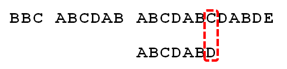

## 字符串问题

### ASCII 码表

'a'(97) 与 'A'(65) 之差为 32

### substr 用法

- 需要`#include <string>`
- 一种构造string的方法，形式是`s.substr(pos,n)`
- 解释：返回一个 string，包含 s 中从 pos 开始的 n 个字符的拷贝（pos的默认值是0，n的默认值是s.size() - pos，即不加参数会默认拷贝整个s）
- 异常：若 pos 的值超过了 string 的大小，则 substr 函数会抛出一个 out_of_range 异常；若 pos+n 的值超过了 string 的大小，则 substr 会调整 n 的值，只拷贝到 string 的末尾

### KMP 算法解决字符串匹配

转自阮一峰的博客

1 首先，字符串"BBC ABCDAB ABCDABCDABDE"的第一个字符与搜索词"ABCDABD"的第一个字符，进行比较。因为B与A不匹配，所以搜索词后移一位。

2 因为B与A不匹配，搜索词再往后移。

3 就这样，直到字符串有一个字符，与搜索词的第一个字符相同为止。

4 接着比较字符串和搜索词的下一个字符，还是相同。

5 直到字符串有一个字符，与搜索词对应的字符不相同为止。

6 这时，最自然的反应是，将搜索词整个后移一位，再从头逐个比较。这样做虽然可行，但是效率很差，因为你要把"搜索位置"移到已经比较过的位置，重比一遍。

7 一个基本事实是，当空格与D不匹配时，你其实知道前面六个字符是"ABCDAB"。KMP算法的想法是，设法利用这个已知信息，不要把"搜索位置"移回已经比较过的位置，继续把它向后移，这样就提高了效率。

8 怎么做到这一点呢？可以针对搜索词，算出一张《部分匹配表》（Partial Match Table）。这张表是如何产生的，后面再介绍，这里只要会用就可以了。

9 已知空格与D不匹配时，前面六个字符"ABCDAB"是匹配的。查表可知，最后一个匹配字符B对应的"部分匹配值"为2，因此按照下面的公式算出向后移动的位数：

$$
移动位数 = 已匹配的字符数 - 对应的部分匹配值
$$

因为 6 - 2 等于4，所以将搜索词向后移动4位。

10 因为空格与Ｃ不匹配，搜索词还要继续往后移。这时，已匹配的字符数为2（"AB"），对应的"部分匹配值"为0。所以，移动位数 = 2 - 0，结果为 2，于是将搜索词向后移2位。

11 因为空格与A不匹配，继续后移一位。

12 逐位比较，直到发现C与D不匹配。于是，移动位数 = 6 - 2，继续将搜索词向后移动4位。

13 逐位比较，直到搜索词的最后一位，发现完全匹配，于是搜索完成。如果还要继续搜索（即找出全部匹配），移动位数 = 7 - 0，再将搜索词向后移动7位，这里就不再重复了。

14 下面介绍《部分匹配表》是如何产生的。

首先，要了解两个概念："前缀"和"后缀"。 "前缀"指除了最后一个字符以外，一个字符串的全部头部组合；"后缀"指除了第一个字符以外，一个字符串的全部尾部组合。

15 "部分匹配值"就是"前缀"和"后缀"的最长的共有元素的长度。以"ABCDABD"为例，

- "A"的前缀和后缀都为空集，共有元素的长度为0；
- "AB"的前缀为\[A\]，后缀为\[B\]，共有元素的长度为0；
- "ABC"的前缀为\[A, AB\]，后缀为\[BC, C\]，共有元素的长度0；
- "ABCD"的前缀为\[A, AB, ABC\]，后缀[BCD, CD, D\]，共有元素的长度为0；
- "ABCDA"的前缀为\[A, AB, ABC, ABCD\]，后缀为\[BCDA, CDA, DA, A\]，共有元素为"A"，长度为1；
- "ABCDAB"的前缀为\[A, AB, ABC, ABCD, ABCDA\]，后缀为\[BCDAB, CDAB, DAB, AB, B\]，共有元素为"AB"，长度为2；
- "ABCDABD"的前缀为\[A, AB, ABC, ABCD, ABCDA, ABCDAB\]，后缀为\[BCDABD, CDABD, DABD, ABD, BD, D\]，共有元素的长度为0。

16 "部分匹配"的实质是，有时候，字符串头部和尾部会有重复。比如，"ABCDAB"之中有两个"AB"，那么它的"部分匹配值"就是2（"AB"的长度）。搜索词移动的时候，第一个"AB"向后移动4位（字符串长度-部分匹配值），就可以来到第二个"AB"的位置。