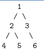
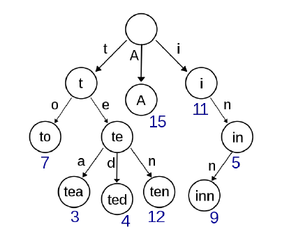

## 树

<!-- TOC -->

- [树](#树)
  - [二叉树的前中后序遍历](#二叉树的前中后序遍历)
  - [满二叉树](#满二叉树)
  - [完全二叉树](#完全二叉树)
  - [二叉树的前中序遍历——非递归形式](#二叉树的前中序遍历非递归形式)
  - [二叉查找/搜索树(BST)](#二叉查找搜索树bst)
  - [字典树](#字典树)

<!-- /TOC -->

### 二叉树的前中后序遍历

前序遍历、中序遍历和后序遍历是三种利用深度优先搜索遍历二叉树的方式。它们对节点访问的顺序有一点不同，其他完全相同。考虑如下一棵树：



前序遍历先遍历父结点,再遍历左结点,最后遍历右节点,我们得到的遍历顺序是 \[1 2 4 5 3 6\]。

```c++
void preorder(TreeNode* root) {
  visit(root);
  preorder(root->left);
  preorder(root->right);
}
```

中序遍历先遍历左节点,再遍历父结点,最后遍历右节点,我们得到的遍历顺序是 \[4 2 5 1 3 6\]。

```c++
void inorder(TreeNode* root) {
  inorder(root->left);
  visit(root);
  inorder(root->right);
}
```

后序遍历先遍历左节点,再遍历右结点,最后遍历父节点,我们得到的遍历顺序是 \[4 5 2 6 3 1\]。

```c++
void postorder(TreeNode* root) {
  postorder(root->left);
  postorder(root->right);
  visit(root);
}
```

### 满二叉树


### 完全二叉树


### 二叉树的前中序遍历——非递归形式

**先序遍历**

```c++
class Solution {

}
```

**中序遍历**

```c++
class Solution {

}
```

**后序遍历**

```c++
class Solution {

}
```

### 二叉查找/搜索树(BST)

二叉查找树(Binary Search Tree, BST)是一种特殊的二叉树:对于每个父节点,其左子节点的值小于等于父结点的值,其右子节点的值大于等于父结点的值。因此对于一个二叉查找树,我们可以在 O(nlogn) 的时间内查找一个值是否存在:从根节点开始,若当前节点的值大于查找值则向左下走,若当前节点的值小于查找值则向右下走。**同时因为二叉查找树是有序的,对其中序遍历的结果即为排好序的数组。**一个二叉树的实现如下：

```c++
template <class T>
class BST {
  struct Node {
    T data;
    Node* left;
    Node* right;
  };

  Node* root;

  Node* makeEmpty(Node* t) {
    if (t == NULL) return NULL;
    makeEmpty(t->left);
    makeEmpty(t->right);
    delete t;
    retur NULL;
  }

  Node* insert(Node* t, T x) {
    if (t == NULL) {
      t = new Node;
      t->data = x;
      t->left = t->right = NULL;
    } else if (x < t->data) {
      t->left = insert(t->left, x);
    } else if (x > t->data) {
      t->right = insert(t->right, x);
    }
    return t;
  }

  Node* find(Node* t, T x) {
    if (t == NULL) return NULL;
    if (x < t->data) return find(t -> left, x);
    if (x > t->data) return find(t -> right, x);
    return t;
  }

  Node* findMin(Node* t) {
    if (t == NULL || t->left == NULL) return t;
    return findMin(t->left);
  }

  Node* findMax(Node* t) {
    if (t == NULL || t->right == NULL) return t;
    return findMax(t->right);
  }

  Node* remove(Node* t, T x) {
    Node* temp;
    if (t == NULL) return NULL;
    else if (x < t->data) t->left = remove(t->left, x);
    else if (x > t->data) t->right = remove(t->right, x);
    // 如果要删除根节点
    else if (t->left && t->right) {
      // 此时根节点变成了右子树的最小值 
      temp = findMin(t->right);
      t->data = temp->data;
      t->right = remove(t->right, t->data);
    } else {
      temp = t;
      if (t->left == NULL) t = t->right;
      else (t->right == NULL) t = t->left;
      delete temp;
    }
    return t;
  }

public:
  BST():root(NULL) {}

  ~BST() {
    makeEmpty(root);
  }

  void insert(T x) {
    insert(root, x);
  }

  void remove(T, x) {
    remove(root, x);
  }
};
```

### 字典树

字典树(Trie)用于判断字符串是否存在或者是否具有某种字符串前缀。



上图中的字典树，存储了单词A、to、tea、ted、ten、i、in 和 inn,以及它们的频率

为什么需要用字典树解决这类问题呢?假如我们有一个储存了近万个单词的字典,即使我们使用哈希,在其中搜索一个单词的实际开销也是非常大的,且无法轻易支持搜索单词前缀。然而由于一个英文单词的长度 n 通常在 10 以内,如果我们使用字典树,则可以在 O(n)——近似 O(1) 的时间内完成搜索,且额外开销非常小。

详见 `leetcode-208-implement-trie-prefix-tree.cpp`。


