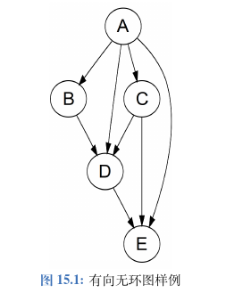
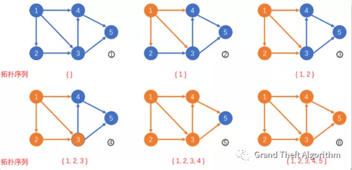
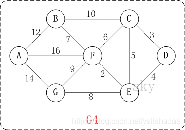
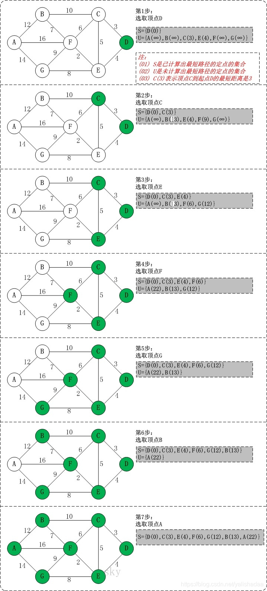

## 图

<!-- TOC -->

- [图](#图)
  - [二分图](#二分图)
  - [拓扑排序](#拓扑排序)
  - [Dijkstra 算法](#dijkstra-算法)

<!-- /TOC -->

图通常分为有向(directed)或无向(undirected),有循环(cyclic)或无循环(acyclic),所有节点相连(connected)或不相连(disconnected)。树即是一种一个相连的无向无环图,而另一种很常见的图是有向无环图(Directed Acyclic Graph,DAG)。

图通常有两种表示方法。假设图中一共有 n 个节点、m 条边。第一种表示方法是邻接矩阵(adjacency matrix)::我们可以建立一个 n × n 的矩阵 G,如果第 i 个节点连向第 j 个节点,则 G\[i\]\[j\] = 1, 反之是 0；如果图是无向的，,则这个矩阵一定是对称矩阵,即 G\[i\]\[j\] = G\[j\]\[i\]。第二种表示方法是邻接链表(adjacency list):我们可以建立一个大小为 n 的数组,每个位置 i 储存一个数组或者链表,表示第 i 个节点连向的其它节点。邻接矩阵空间开销比邻接链表大,但是邻接链表不支持快速查找 i 和 j 是否相连,因此两种表示方法可以根据题目需要适当选择。除此之外,我们也可以直接用一个 m × 2 的矩阵储存所有的边。

图论中：
节点度是指和该节点相关联的边的条数，又称关联度。
特别地，对于有向图，
节点的入度 是指进入该节点的边的条数；
节点的出度是指从该节点出发的边的条数。

入度 \
入度是图论算法中重要的概念之一。它通常指有向图中某点作为图中边的终点的次数之和。

入度的常见情况：\
入度为0，顾名思义，入度为0指有向图中的点不作为任何边的终点，也就是说，这一点所连接的边都把这一点作为起点。

度的相关定理：\
定理1：无向图中所有顶点的度之和等于边数的2倍，有向图中所有顶点的入度之和等于所有顶点的出度之和。\
定理2 任意一个无向图一定有偶数个（或0个）奇点（度为奇数的顶点）。\
定理3 无论无向图还是有向图，顶点数n，边数e和度之间又如下关系：
E=(d\[v1\]+d\[v2\]+…+d\[vn\])/2;

### 二分图

二分图算法也称为染色法,是一种广度优先搜索。如果可以用两种颜色对图中的节点进行着色,并且保证相邻的节点颜色不同,那么图为二分。

### 拓扑排序

拓扑排序(topological sort)是一种常见的,对有向无环图排序的算法。给定有向无环图中的 N 个节点,我们把它们排序成一个线性序列;若原图中节点 i 指向节点 j,则排序结果中 i 一定在 j 之前。拓扑排序的结果不是唯一的,只要满足以上条件即可。所以，如果图中有环，则无法提取出拓扑排序，**所以拓扑排序的一个重要应用是判断在给定的环路中判定是否存在环路。**

- 拓扑排序是找到图中入度为 0 的节点，以及仅由入度为 0 节点所指向的节点。而本题是找到图中 **出度为 0 的节点，以及仅指向出度为 0 节点的节点。** 刚好是相反的情况，所以，我们将题目给定的有向图变为反图（也即有向边的起点、终点互换），那么所有安全点便可以通过拓扑排序来求解了。

拓扑排序的思想：

1. 将所有入度为 0 的点（原图中出度为 0 的点，也就是终点，最简单的安全点）加入队列;
2. 每次循环访问位于队头的节点（安全点），并将此节点从队列中弹出;
3. 遍历以该节点为起点的所有有向边，将其从图中去掉，也即将将该点指向的所有点的入度减一。
4. 若某被指向点入度变为 0（意味着指向这个点的点均曾经被加入过队列，说明均为安全点），则将此点入队
5. 重复 2、3、4 直至队列为空。

拓扑排序的图示：

首先，给定图中仅有节点 1 入度为 0，我们将其加入队列。

我们将节点 1 为起点的有向边均删掉（在图中变为橙色），更新这些有向边终点的入度，节点 2,3,4 入度均减 1，变为 \[0,1,1\]。由于节点 2 的入度变为了 0，我们将其加入队列。

我们将节点 2 为起点的有向边均删掉，更新这些有向边终点的入度，节点 3 入度减一，变为 \[0\]。我们将其加入队列。

我们将节点 3 为起点的有向边均删掉，更新这些有向边终点的入度，节点 4,5 入度均减一，变为 \[0,1\]。由于节点 4 的入度变为了 0，我们将其加入队列。

我们将节点 4 为起点的有向边均删掉，更新这些有向边终点的入度，节点 5 入度减一，变为 \[0\]。由于节点 5 的入度变为了 0，我们将其加入队列。

我们将节点 5 为起点的有向边均删掉，此时全图已经遍历完毕，没有新的节点被加入队列。

队列为空，拓扑排序结束。

### Dijkstra 算法

Dijkstra(迪杰斯特拉)算法是典型的单源最短路径算法，用于计算一个节点到其他所有节点的最短路径。主要特点是以起始点为中心向外层层扩展，直到扩展到终点为止。Dijkstra 算法是很有代表性的最短路径算法，并且该算法要求图中不存在负权边。

**问题描述：** 在无向图 G=(V,E) 中，假设每条边 E\[i\] 的长度为 w\[i\]，找到由顶点 V0 到其余各点的最短路径。（单源最短路径）

**算法思想：** 设G=(V,E)是一个带权有向图，把图中顶点集合V分成两组，第一组为已求出最短路径的顶点集合（用S表示，初始时S中只有一个源点，以后每求得一条最短路径 , 就将加入到集合S中，直到全部顶点都加入到S中，算法就结束了），第二组为其余未确定最短路径的顶点集合（用U表示），按最短路径长度的递增次序依次把第二组的顶点加入S中。在加入的过程中，总保持从源点v到S中各顶点的最短路径长度不大于从源点v到U中任何顶点的最短路径长度。。此外，每个顶点对应一个距离，S中的顶点的距离就是从v到此顶点的最短路径长度，U中的顶点的距离，是从v到此顶点只包括S中的顶点为中间顶点的当前最短路径长度。

**算法步骤：**

1. 初始时，S只包含起点s；U包含除s外的其他顶点，且U中顶点的距离为"起点s到该顶点的距离"（例如，U中顶点v的距离为(s,v)的长度，如果s和v不相邻，则v的距离为∞）。
2. 从U中选出"距离最短的顶点k"，并将顶点k加入到S中；同时，从U中移除顶点k。
3. 更新U中各个顶点到起点s的距离。之所以更新U中顶点的距离，是由于上一步中确定了k是求出最短路径的顶点，从而可以利用k来更新其它顶点的距离；例如，(s,v)的距离可能大于(s,k)+(k,v)的距离。
4. 重复步骤(2)和(3)，直到遍历完所有顶点。

