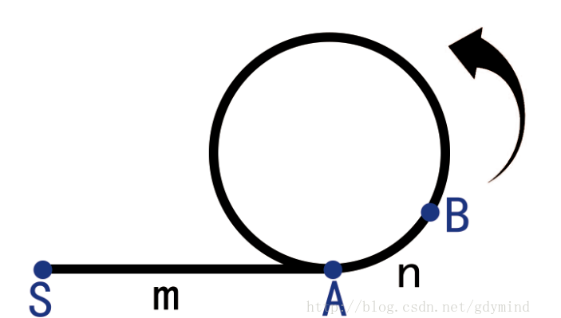

## 双指针方法总结

双指针主要用于遍历数组，两个指针指向不同的元素，从而协同完成任务。也可以延伸到多个数组的多个指针。若两个指针指向同一数组，遍历方向相同且不会相交，则也称为滑动窗口(两个指针包围的区域即为当前的窗口)，经常用于区间搜索。若两个指针指向同一数组，但是遍历方向相反，则可以用来进行搜索，待搜索的数组往往是排好序的。

一些常见的关于指针的操作如下：

### 指针与常量

```c++
int x;
// 指针可以被修改，值也可以被修改
int *p1 = &x;
// 指针可以被修改，值不可以被修改
const int *p1 = &x;
// 指针不可以被修改，值可以被修改
int * const p3 = &x;
// 指针不可以被修改，值可以被修改
const int * const p4 = &x;
```

### 指针与函数指针

```c++
// addition是指针函数,一个返回类型是指针的函数
int* addition(int a, int b) {
  int* sum = new int(a + b);
  return sum;
}

int subtraction(int a, int b) {
  return a - b;
}

int operation(int x, int y, int (*func)(int, int)) {
  return (*func)(x,y);
}

// minus是函数指针,指向函数的指针--**括号改变了运算的优先级**
int (*minus)(int, int) = subtraction;

int* m = addition(1, 2);
int n = operation(3, *m, minus);
```

### Floyd 判圈法

初始状态下，假设已知某个起点节点为节点 S。现设两个指针 t 和 h，将它们均指向 S。

接着，同时让 t 和 h 往前推进，但是二者的速度不同：t 每前进 1 步，h 前进 2 步。只要二者都可以前进而且没有相遇，就如此保持二者的推进。当 h 无法前进，即到达某个没有后继的节点时，就可以确定从 S 出发不会遇到环。反之当 t 与 h 再次相遇时，就可以确定从 S 出发一定会进入某个环，设其为环 C。

如果确定了存在某个环，就可以求此环的起点与长度。

上述算法刚判断出存在环 C 时，显然 t 和 h 位于同一节点，设其为节点 B。显然，仅需令 h 不动，而 t 不断推进，最终又会返回节点 B，统计这一次 t 推进的步数，显然这就是环 C 的长度。

为了求出环 C 的起点，只要令 h 仍均位于节点 B，而令 t 返回起点节点 S，此时 h 与 t 之间距为环 C 长度的整数倍。随后，同时让 t 和 h 往前推进，且保持二者的速度相同：t 每前进 1 步，h 前进 1 步。持续该过程直至 t 与 h 再一次相遇，设此次相遇时位于同一节点 P，则节点 P 即为从节点 S 出发所到达的环 C 的第一个节点，即环 C 的一个起点。 

**证明：** 



设节点 B 是指针 t 和 h 的相遇点，t 在入环点 A 前走了 m 步，在入环后走了 n 步，由于 h 走的步数是 t 的两倍，并且在入环前走了 m 步，所以在入环后走了 `2m + 2n - m = m + 2n` 步，并且由于此时 t 和 h **在环上走的步数之差为**环 C 长度的整数倍，即 `m + n` 为环长的整数倍。此时，将 t 放到起始点 S，并且保持 t 和 h 速度相同，t 和 h 走 m 步，当 t 到达入环点时，t 在 B 点的基础上走了 m 步，在环上共走了 m + n 步：为环长的整数倍，在环 C 的入环点相遇(节点 A)。