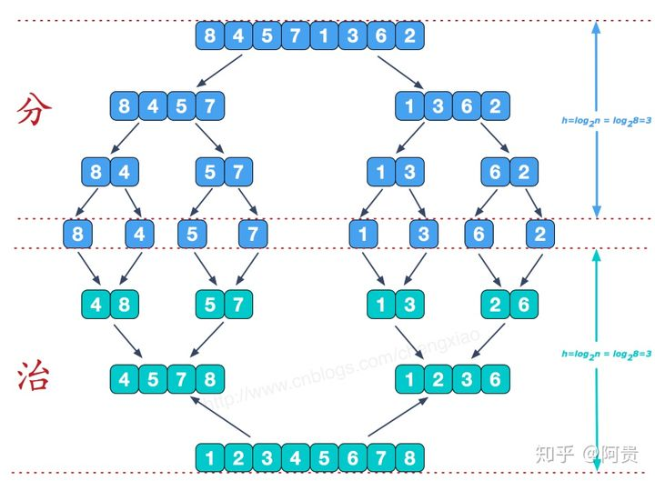
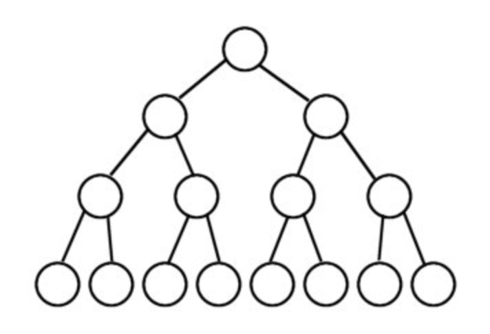
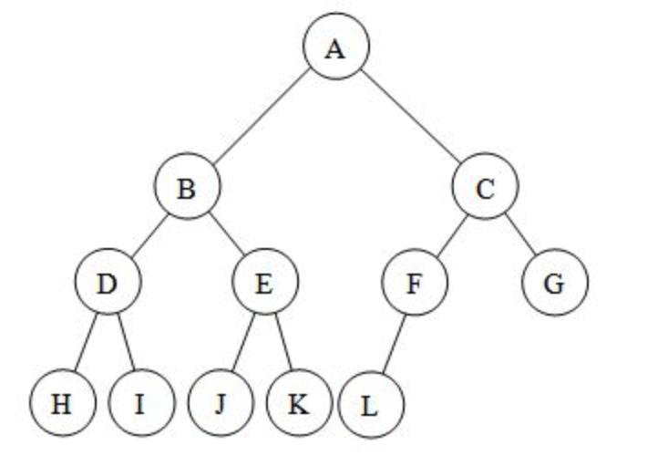
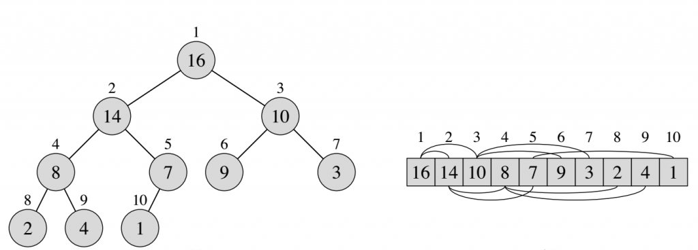
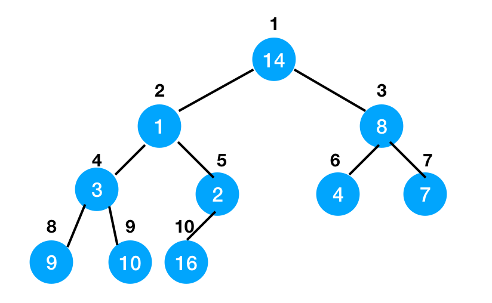

## 排序算法总结

常用的排序算法

<!-- TOC -->

- [排序算法总结](#排序算法总结)
  - [快速排序(Quick sort)](#快速排序quick-sort)
  - [归并排序(Merge sort)](#归并排序merge-sort)
  - [插入排序(Insertion sort)](#插入排序insertion-sort)
  - [冒泡排序(Bubble sort)](#冒泡排序bubble-sort)
  - [选择排序(Selection sort)](#选择排序selection-sort)
  - [堆排序(Heap sort)](#堆排序heap-sort)
  - [稳定和不稳定排序](#稳定和不稳定排序)

<!-- /TOC -->

### 快速排序(Quick sort)

是 C.R.A.Hoare 于 1962 年提出的一种划分交换排序。它采用了一种分治的策略，属于分治法(Divide-and-Conquer Method)。快速排序的基本思想是：通过一趟排序将要排序的数据分割成独立的两部分，其中一部分的所有数据都比另外一部分的所有数据都要小，然后再按此方法对这两部分数据分别进行快速排序，整个排序过程可以递归进行，以此达到整个数据变成有序序列。快速排序是一种不稳定的排序算法，所谓的不稳定就是说，多个相同的值的相对位置也许会在算法结束时产生变动。

基本思路为：

1. 先从要排序的序列中取出一个数作为基准数(key 或者 pivot)；
2. 分区过程，将比这个数大的数全放到它的右边，小于它的数全放到它的左边；
3. 再对左右区间重复第二步，直到各区间只有一个数。

可以把快速排序想象成一项一边拆一边补的拆补工程，直到所有元素达到有序状态，如下图所示：


以下代码实际上采用的是左闭右闭的二分写法。**因为有 `int last = r - 1;` 这句话。**

```c++
void quick_sort(vector<int>& nums, int l, int r) {
  if (l + 1 >= r) {
    return;
  }
  // key 代表基准数
  int first = l, last = r - 1, key = nums[first];
  // 根据基准数，完成一趟排序，跳出循环的条件是 first == last
  while (first < last) {
    while (first < last && nums[last] >= key) {
      --last;
    }
    nums[first] = nums[last];
    while (first < last && nums[first] <= key) {
      ++first;
    }
    nums[last] = nums[first];
  }
  // 实际上这时候 nums[first] = nums[last] = key
  nums[first] = key;
  //-- 到这里就完成了一趟排序

  // 对左边区间排序
  quick_sort(nums, l, first);
  // 对右边区间排序
  quick_sort(nums, first + 1, r);
}
```

快速排序的最好和平均时间复杂度为 O(nlogn)，最坏情况下为 O(n^2)。可以通过在算法中引入随机性，使得算法对所有输入都能获得较好的期望性能。比如我们随机地选择基准数，这样上述的最坏情况就很难发生。

### 归并排序(Merge sort)

在比较类排序中，归并排序号称最快，其次是快速排序和堆排序，两者不相伯仲，但是有一点需要注意，数据初始排序状态对堆排序不会产生太大的影响，而快速排序却恰恰相反。快排的平均情况下时间复杂度是 O(nlogn), 最坏情况下为O(n^2)。 归并排序的好处就是时间复杂度总是 O(nlogn)。所以归并排序在时间方面可以 beats quick sort。

归并排序（MERGE-SORT）是利用归并的思想实现的排序方法，该算法采用经典的分治（Divide-and-Conquer）策略（分治法将问题分(divide)成一些小的问题然后递归求解，而治(conquer)的阶段则将分的阶段得到的各答案"修补"在一起，即分而治之)。将已有序的子序列合并，得到完全有序的序列；即先使每个子序列有序，再使子序列段间有序。若将两个有序表合并成一个有序表，称为 2-路归并。把长度为 n 的输入序列分成两个长度为 n/2 的子序列；对这两个子序列分别采用归并排序；将两个排序好的子序列合并成一个最终的排序序列。



从上图可以看出，每次合并操作的平均时间复杂度为 O(n)，而完全二叉树的深度为 \|log<sub>2</sub>n\|，总的时间复杂度为 O(nlogn)。而且，归并排序的最好，最坏，平均时间复杂度均为 O(nlogn)。

**合并相邻有序的子序列**

再来看看 conquer 阶段，我们需要将两个已经有序的子序列合并成一个有序序列，比如上图中的最后一次合并，要将 \[4,5,7,8\]和 \[1,2,3,6\] 两个已经有序的子序列，合并为最终序列 \[1,2,3,4,5,6,7,8\]，来看下实现步骤。


代码实现如下，采用**左闭右开**的写法：

```c++
void merge_sort(vector<int> &nums, int l, int r, vector<int> &temp) {
  if (l + 1 >= r) {
    return;
  }

  // divide
  int mid = l + (r - l) / 2;
  // 为什么这么写，因为采用左闭右开的写法，所以下面第一行的 mid 实际上不能被取到， 下面第二行的 r 实际上不能被取到
  merge_sort(nums, l, mid, temp);
  merge_sort(nums, mid, r, temp);

  // conquer
  int p = l, q = mid, i = l;
  while (p < mid && q < r) {
    if (nums[p] < nums[q]) {
      temp[i++] = nums[p++];
    } else {
      temp[i++] = nums[q++];
    }
  }

  //--考虑特殊情况，实际上是边界情况
  while (p < mid) {
    temp[i++] = nums[p++];
  }
  while (q < r) {
    temp[i++] = nums[q++];
  }
  //--以上考虑特殊情况，实际上是边界情况

  for (i = l; i < r; ++i) {
    nums[i] = temp[i];
  }
}
```

### 插入排序(Insertion sort)

插入排序是一种简单直观的排序算法。其基本思想是：把待排序的值按其大小逐个插入到一个已经排好序的有序序列中（排序扑克牌），直到所有待排序的值插入完为止，得到一个新的有序序列。**插入排序对于少量元素的排序是一个有效的算法。**

在打扑克牌的时候，每一次摸完牌，都会按数字大小或者花色，插入到合适的位置，直到摸完最后一张牌，我们手中的牌已经按大小顺序排列好了。这整个过程就是一个插入排序。

由于重复地走访过要排序的数列，一次比较两个元素，如果他们的顺序错误就把他们交换过来。插入排序和冒泡排序在平均和最坏情况下的时间复杂度都是 O(n^2)，最好情况下都是O(n)，空间复杂度是 O(1)。

```c++
void insertion_sort(vector<int>& nums, int n) {
  for (int i = 0; i < n; ++i) {
    for (int j = i; j > 0; --j) {
      if (nums[j] < nums[j - 1]) {
        swap(nums[j], nums[j - 1]);
      }
    }
  }
```

**泛型算法 swap**

swap 的函数原型：

```c++
template <class T> void swap(T& a, T& b) {
  T c(a);
  a = b;
  b = c;
}
```

利用 swap() 函数进行内存的释放：

在 vector 数据结构中：.erase() 删除元素；.clear() 清空数据；.size() 当前 vector 容器内存储的元素个数；.capacity() 当前vector容器重新分配内存之前所能容纳的元素数量；.swap() 函数交换；.reverse() 向系统预定一段足够的连续的空间

但是，vector 与 deque 不同，其内存占用空间只会增长，不会减小。比如你首先分配了10000个字节，然后 erase 掉后面 9999 个，则虽然有效元素只有一个，但是内存占用仍为10000 个。也就是说仅有 size() 的结果发生了变化，capacity() 保持不变。所有空间在 vector 析构时回收。一般，我们都会通过 vector 中成员函数 clear 进行清除操作，但它清除的是所有的元素，使 vector 的大小减少至 0，却不能减小 vector 占用的内存。要避免 vector 持有它不再需要的内存，这就需要一种方法来使得它从曾经的容量减少至它现在需要的容量，这样减少容量的方法被称为“收缩到合适（shrink to fit）”。（节选自《Effective STL》），可以通过如下代码释放过剩的容量：

```c++
vector<T>().swap()
```

在以下代码中可以看到，用 clear() 无法保证内存回收。但是 swap() 可以。

```c++
#include <iostream>  
#include <algorithm>  
#include <vector>  
#include <iterator>  
  
using namespace std;  
  
int main ()   
{  
  int x = 10;  
  vector<int> myvector(10000, x);    
  
  //这里打印仅仅是元素的个数不是内存大小  
  cout << "myvector size:"  
       << myvector.size()  
       << endl;  
  
  //swap交换函数释放内存：vector<T>().swap(X);  
  //T:int ; myvertor代表X  
  vector<int>().swap(myvector);  
  
  //两个输出仅用来表示swap前后的变化  
  cout << "after swap :"  
       << myvector.size()  
       << endl;  
  
  return 0;  
}
```

在输出中 `after swap :0`。代码中，vector<int>() 使用 vector 的默认构造函数建立临时 vector 对象，再在该临时对象上调用 swap() 函数，swap() 调用之后对象 myvector 占用的空间就等于一个默认构造的对象的大小，临时对象就具有原来对象 myvector 的大小，而该临时对象随即就会被析构，从而其占用的空间也被释放：

```c++
std::vector<T>().swap(X)

// 作用相当于：
{
  std::vector<T>  temp(X);
  temp.swap(X);
}
```

### 冒泡排序(Bubble sort)

冒泡排序依次比较相邻的数据，将小数据放在前，大数据放在后；即第一趟先比较第 1 个和第 2 个数，大数在后，小数在前，再比较第 2 个数与第 3 个数，大数在后，小数在前，以此类推则将最大的数"滚动"到最后一个位置；第二趟则将次大的数滚动到倒数第二个位置......第 n-1 (n 为无序数据的个数)趟即能完成排序。对冒泡排序算法进行简单的优化，用一个标记来记录在一趟的比较过程中是否存在交换，如果不存在交换则整个数组已经有序，退出排序过程，反之则继续进行下一趟的比较。

由于重复地走访过要排序的数列，一次比较两个元素，如果他们的顺序错误就把他们交换过来。插入排序和冒泡排序在平均和最坏情况下的时间复杂度都是 O(n^2)，最好情况下都是 O(n)，空间复杂度是 O(1)。

```c++
void bubble_sort(vector<int> &nums, int n) {
  bool swapped = false;
  for (int i = 1; i < n; ++i) {
    swapped = false;
    for (int j = 1; j < n - i + 1; ++j) {
      if (nums[j] < nums[j - 1]) {
        swap(nums[j], nums[j - 1]);
        swapped = true;
      }
    }
    if (!swapped) {
      break;
    }
  }
}
```

### 选择排序(Selection sort)

简单选择排序采用最简单的选择方式，从头到尾顺序扫描序列，找出最小的一个记录，和第一个记录交换，接着从剩下的记录中继续这种选择和交换，最终使序列有序。 

```c++
void selection_sort(vector<int>& nums, int n) {
  int mid;
  for (int i = 0; i < n - 1; ++i) {
    mid = i;
    for (int j = i + 1; j < n; ++j) {
      if (nums[j] < nums[mid]) {
        mid = j;
      }
    }
    swap(nums[mid], nums[i]);
  }
}
```

最好情况，序列有序，时间复杂度为 O(n); 最坏情况，序列逆序，时间复杂度为 O(n^2); 平均时间复杂度为 O(n^2)。需要额外的辅助变量，因此空间复杂度为 O(1)。

### 堆排序(Heap sort)

注意，算法和数据结构里面的堆（Heap）和内存分配里面的堆（Heap）并不是一个概念。算法和数据结构中的所谓堆，就是一个用一维数组来表示一个完全二叉树的这么一个数据结构。所谓二叉树就是一种树，每一个父节点，有最多两个子节点，一般叫做左右子树。

完美二叉树的定义是一个二叉树层数为 k 的时候，它的元素数量等于 2<sup>k</sup>-1:



而一个完全二叉树可以理解为是一个完美二叉树缺少一部分或者不缺少一部分的二叉树，但是内容一定是从上到下，从左到右的填充，也就是缺少的部分总在右边。如下图：



我们用堆来存储上面这个完全二叉树的话，我们就可以存储为一个数组元素依次为[A, B, C, D, E, F, G, H, I, J, K, L]。虽然完全二叉树不像完美二叉树那样是每一层都完整的。但是因为数组的这个存储方式。我们可以保证的知道，这个二叉树的根节点的索引是1（顺序索引，也就是数组索引的0）。

而任何一个子节点的父节点的索引是子节点的顺序索引整除 2。而左子树的根节点是父节点的索引乘2，右子树的根节点是父节点的索引乘2+1。

所以，我们很容易得到子节点和父节点互相访问的函数：

```c++
int parent(int i) {
  return i >> 1;
}

int left(int i) {
  return i << 1;
}

int right(int i) {
  return (i<<1) + 1;
}
```
然后，我们可以定义一个数据结构，叫做最大堆（Max-Heap），这个数据结构的特点是每个父节点，都大于自己的子节点，那么我们也知道根节点一定是最大的。下图是一个最大堆，树结构和它在数组中的状态。



你可以简单的想像一个最小堆，其实就是最大堆的一个反面。我们就不细说了。

假设一个最大堆的某个节点比自己的子节点小，这就说明它违反了最大堆的属性，但是他的子节点都是合法的最大堆，我们怎么纠正这个错误，让这个节点恢复成一个合法的最大堆呢？这个操作，我们叫做 Max-Heapify，最大堆合法化。操作思路是，我们比较这个节点和它的直接左右子节点，谁大，谁变成新的父节点，也就是当前节点和它最大的直接子节点交换。然后，我们检查这个新的直接子节点，是否比自己的子节点小，如果小也交换。简单的说，就是把一个小的父节点，一步步下沉。

然后，假设我们从一个完全不符合最大堆原则的二叉树出发如何能够建立一个最大堆呢？假设我们有如下的堆：



我们的方法是从堆的中间(也就是从 5 这个位置)出发，往回一个节点地进行 Max-Heapify 操作（操作的节点顺序为 5->4->3->2->1），结束后，这个堆就是最大堆了。简单的描述就是从堆的中间点到根节点，调用 Max-Heapify 操作即可：

```c++
void buildMaxHeap() {
  for (int i = unSortedArray.length/2; i >= 1; --i) {
    maxHeapify(i);
  }
}
```

我们仔细观察最大堆结构的时候，可能有一个结论是，最大堆不是一个有完全顺序的数据结构。虽然每个父节点都大于自己的子节点。但是左子树的根不见得大于或者小于有右子树的根。我们不能直接用二叉树的任何遍历方式得到一个有序数组。那么我们怎么用堆来排序呢。

我们可以首先获得堆的根节点，然后根节点和最后一个节点互换，然后我们缩小堆，让刚才被换到最后一个位置的原来的根节点从堆中被移除。然后我们 Max-Heapify 堆的根节点，保证堆仍旧是一个合法的堆，然后我们取堆的根节点。也就是说，我们知道堆的根节点一定是最大的，我们把它放到最后面。这时候破坏了堆，我们不管取出来的那个数（缩小堆），我们 Max-Heapify 堆，然后堆根节点又是最大的了。这样我们就一步步找到了最大数，把他们排列在后面，直到最后我们就获得了一个从小到大的数组。如果要从大到小排序我们就需要用到最小堆了。

堆还可以支持的一个操作是把当前的堆顶返回，然后缩小堆。这跟堆排序的思想一样，但是**可以解决我们只想知道最大值，或者最大几个值，而不需要全部排序的需求**。

所以，最大堆的第一个功能是用来实现堆排序。第二个功能，如果我们的目标不是完全排序，而是想找到最大数，或者最大k个数，那么用堆比全部排序开销更低一些。

以上排序算法的调用方法为

```c++
vector<int> nums = {1,3,5,7,2,6,4,8,9,2,8,7,6,0,3,5,9,4,1,0};
vector<int> temp(nums.size());
sort(nums.begin(), nums.end());
quick_sort(nums, 0, nums.size());
merge_sort(nums, 0, nums.size(), temp);
insertion_sort(nums, nums.size());
bubble_sort(nums, nums.size());
selection_sort(nums, nums.size());
```

### 稳定和不稳定排序

稳定的排序算法：

如：插入排序，基数排序，归并排序，冒泡排序，计数排序。

不稳定的排序算法：

不稳定的排序算法有：快速排序，希尔排序，选择排序，堆排序。

