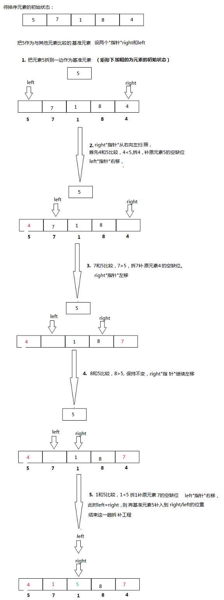

## 排序算法总结

常用的排序算法

<!-- TOC -->

- [排序算法总结](#排序算法总结)
  - [快速排序(Quick sort)](#快速排序quick-sort)
  - [归并排序(Merge sort)](#归并排序merge-sort)
  - [插入排序(Insertion sort)](#插入排序insertion-sort)
  - [冒泡排序(Bubble sort)](#冒泡排序bubble-sort)
  - [选择排序(Selection sort)](#选择排序selection-sort)

<!-- /TOC -->

### 快速排序(Quick sort)

是 C.R.A.Hoare 于 1962 年提出的一种划分交换排序。它采用了一种分治的策略，属于分治法(Divide-and-Conquer Method)。快速排序的基本思想是：通过一趟排序将要排序的数据分割成独立的两部分，其中一部分的所有数据都比另外一部分的所有数据都要小，然后再按此方法对这两部分数据分别进行快速排序，整个排序过程可以递归进行，以此达到整个数据变成有序序列。快速排序是一种不稳定的排序算法，所谓的不稳定就是说，多个相同的值的相对位置也许会在算法结束时产生变动。

基本思路为：

1. 先从要排序的序列中取出一个数作为基准数(key 或者 pivot)；
2. 分区过程，将比这个数大的数全放到它的右边，小于它的数全放到它的左边；
3. 再对左右区间重复第二步，直到各区间只有一个数。

可以把快速排序想象成一项一边拆一边补的拆补工程，直到所有元素达到有序状态，如下图所示：



以下代码实际上采用的是左闭右闭的二分写法。**因为有 `int last = r - 1;` 这句话。**

```c++
void quick_sort(vector<int>& nums, int l, int r) {
  if (l + 1 >= r) {
    return;
  }
  // key 代表基准数
  int first = l, last = r - 1, key = nums[first];
  // 根据基准数，完成一趟排序，跳出循环的条件是 first == last
  while (first < last) {
    while (first < last && nums[last] >= key) {
      --last;
    }
    nums[first] = nums[last];
    while (first < last && nums[first] <= key) {
      ++first;
    }
    nums[last] = nums[first];
  }
  nums[first] = key;
  //-- 到这里就完成了一趟排序

  // 对左边区间排序
  quick_sort(nums, l, first);
  // 对右边区间排序
  quick_sort(nums, first + 1, r);
}
```

快速排序的最好和平均时间复杂度为 O(nlogn)，最坏情况下为 O(n^2)。

### 归并排序(Merge sort)

在比较类排序中，归并排序号称最快，其次是快速排序和堆排序，两者不相伯仲，但是有一点需要注意，数据初始排序状态对堆排序不会产生太大的影响，而快速排序却恰恰相反。快排的平均情况下时间复杂度是 O(nlogn), 最坏情况下为O(n^2)。 归并排序的好处就是时间复杂度总是 O(nlogn)。所以归并排序在时间方面可以 beats quick sort。

归并排序（MERGE-SORT）是利用归并的思想实现的排序方法，该算法采用经典的分治（Divide-and-Conquer）策略（分治法将问题分(divide)成一些小的问题然后递归求解，而治(conquer)的阶段则将分的阶段得到的各答案"修补"在一起，即分而治之)。将已有序的子序列合并，得到完全有序的序列；即先使每个子序列有序，再使子序列段间有序。若将两个有序表合并成一个有序表，称为 2-路归并。把长度为 n 的输入序列分成两个长度为 n/2 的子序列；对这两个子序列分别采用归并排序；将两个排序好的子序列合并成一个最终的排序序列。


从上图可以看出，每次合并操作的平均时间复杂度为 O(n)，而完全二叉树的深度为 \|log2n\|，总的时间复杂度为 O(nlogn)。而且，归并排序的最好，最坏，平均时间复杂度均为 O(nlogn)。

**合并相邻有序的子序列**

再来看看 conquer 阶段，我们需要将两个已经有序的子序列合并成一个有序序列，比如上图中的最后一次合并，要将 \[4,5,7,8\]和 \[1,2,3,6\] 两个已经有序的子序列，合并为最终序列 \[1,2,3,4,5,6,7,8\]，来看下实现步骤。


代码实现如下，采用**左闭右开**的写法：

```c++
void merge_sort(vector<int> &nums, int l, int r, vector<int> &temp) {
  if (l + 1 >= r) {
    return;
  }

  // divide
  int mid = l + (r - l) / 2;
  // 为什么这么写，因为采用左闭右开的写法，所以下面第一行的 mid 实际上不能被取到， 下面第二行的 r 实际上不能被取到
  merge_sort(nums, l, mid, temp);
  merge_sort(nums, mid, r, temp);

  // conquer
  int p = l, q = mid, i = l;
  while (p < mid && q < r) {
    if (nums[p] < nums[q]) {
      temp[i++] = nums[p++];
    } else {
      temp[i++] = nums[q++];
    }
  }

  //--考虑特殊情况，实际上是边界情况
  while (p < mid) {
    temp[i++] = nums[p++];
  }
  while (q < r) {
    temp[i++] = nums[q++];
  }
  //--以上考虑特殊情况，实际上是边界情况

  for (i = l; i < r; ++i) {
    nums[i] = temp[i];
  }
}
```

### 插入排序(Insertion sort)


```c++
void insertion_sort(vector<int>& nums, int n) {
  for(int i = 0; i < n; ++i) {
    for(int j = i; j > 0 && nums[j] < nums[j-1]; --j) {
      swap(nums[j], nums[j-1]);
    }
  }
}
```

**泛型算法 swap**

swap 的函数原型：

```c++
template <class T>
```

### 冒泡排序(Bubble sort)

```c++
void bubble_sort(vector<int> &nums, int n) {
  
}
```

### 选择排序(Selection sort)

```c++
void selection_sort(vector<int> &nums, int n) {

}
```

以上排序算法的调用方法为

```c++
vector<int> nums = {1,3,5,7,2,6,4,8,9,2,8,7,6,0,3,5,9,4,1,0};
vector<int> temp(nums.size());
sort(nums.begin(), nums.end());
quick_sort(nums, 0, nums.size());
merge_sort(nums, 0, nums.size(), temp);
insertion_sort(nums, nums.size());
bubble_sort(nums, nums.size());
selection_sort(nums, nums.size());
```

