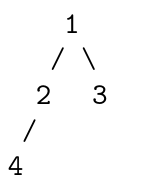

## 一切皆可搜索

深度优先搜索和广度优先搜索是两种最常见的搜索方法，他们被广泛运用在图和树等结构中进行搜索。

### 深度优先搜索

深度优先搜索(depth-first seach,DFS)在搜索到一个新的节点时，立即对该新节点进行遍历；因此遍历需要用先入后出的栈来实现，也可以通过与栈等价的递归来实现。对于树结构而言，由于总是对新节点调用遍历，因此看起来是向着“深”的方向前进。

考虑如下一棵简单的树



考虑如下一颗简单的树。我们从 1 号节点开始遍历,假如遍历顺序是从左子节点到右子节点，那么按照优先向着“深”的方向前进的策略,假如我们使用递归实现,我们的遍历过程为 1(起始节点)->2(遍历更深一层的左子节点)->4(遍历更深一层的左子节点)->2(无子节点,返回父结点)->1(子节点均已完成遍历,返回父结点)->3(遍历更深一层的右子节点)->1(无子节点,返回父结点)-> 结束程序(子节点均已完成遍历)。如果我们使用栈实现,我们的栈顶元素的变化过程为 1->2->4->3。

深度优先搜索也可以用来检测环路:记录每个遍历过的节点的父节点,若一个节点被再次遍历且父节点不同,则说明有环。我们也可以用之后会讲到的拓扑排序判断是否有环路,若最后存在入度不为零的点,则说明有环。

有时我们可能会需要对已经搜索过的节点进行标记,以防止在遍历时重复搜索某个节点,这种做法叫做状态记录或记忆化(memoization)。

### 回溯法

回溯法(backtracking)是优先搜索的一种特殊情况，又称为试探法，常用于需要记录节点状态的**深度优先搜索**。通常来说，**排列、组合、选择类问题**使用回溯法比较方便。

顾名思义,回溯法的核心是回溯。在搜索到某一节点的时候,如果我们发现目前的节点(及其子节点)并不是需求目标时,我们回退到原来的节点继续搜索,并且把在目前节点修改的状态
还原。这样的好处是我们可以始终只对图的总状态进行修改,而非每次遍历时新建一个图来储存状态。在具体的写法上,它与普通的深度优先搜索一样,都有 \[修改当前节点状态\]→\[递归子节点\] 的步骤,只是多了回溯的步骤,变成了 \[修改当前节点状态\]→\[递归子节点\]→\[回改当前节点状态\]。

**回溯法的两个小诀窍：一是按引用传状态，二是所有的状态修改在递归完成后回改。** 看题目 46 中的注释就能理解了！

回溯法修改一般有两种情况，一种是修改最后一位输出，比如排列组合；一种是修改访问标记，比如矩阵里搜字符串。

### 广度优先搜索

广度优先搜索(breadth-first search,BFS)不同与深度优先搜索，它是一层层进行遍历的，因此需要用先入先出的队列而非先入后出的栈进行遍历。由于是按层次进行遍历，广度优先搜索时按照“广”的方向进行遍历的，也常常用来处理**最短路径**等问题。

考虑如下一颗简单的树，我们从一号节点开始遍历，假如遍历顺序是从左子节点到右子节点，那么按照优先向着“广”的方向前进的策略，队列顶端的元素变化过程为 \[1\]->\[2->3\]->\[4\]，其中方括号代表每一层的元素。


### 全排列——next_permutation()

组合数学中经常用到排列，这里介绍一个计算序列全排列的函数：`next_permutation（start,end）`，和 `prev_permutation（start,end）`。这两个函数作用是一样的，区别就在于前者求的是当前排列的下一个排列，后一个求的是当前排列的上一个排列。至于这里的“前一个”和“后一个”，我们可以把它理解为序列的字典序的前后，严格来讲，就是对于当前序列 pn，他的下一个序列 pn+1 满足：不存在另外的序列pm，使pn\< pm \< pn+1。

函数原型为：

```c++
bool next_permutation(iterator start, iterator end);
```

```c++
int nums[3] = {1, 2, 3};
do {
  cout << nums[0] << nums[1] << nums[2] << endl;
} while (next_permutation(nums, nums+3))
```
