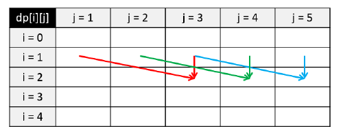
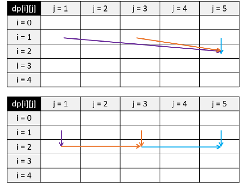

### 背包问题

背包问题是一种组合优化的 NP 完全问题，有 N 个物品和容量为 W 的背包，每个物品都有自己的体积 w 和价值 v，求拿哪些物品可以使得背包所装下物品的总价值最大。如果限定每种物品只能选择 0 个或 1 个，则问题称为 0-1 背包问题。如果不限定每种物品的数量，则问题称为无界背包问题或完全背包问题。

我们可以用动态规划来解决背包问题。以 0-1 背包问题为例。我们可以定义一个二维数组 dp **存储最大价值**，其中 dp\[i\]\[j\] 表示前 i 件物品体积不超过 j 的情况下能达到的最大价值。在我们遍历到第 i 件物品时，在当前背包总容量为 j 的情况下，如果我们不将物品 i 放入背包,那么 dp\[i\]\[j\] = dp\[i-1\]\[j\]，即前 i 个物品的最大价值等于只取前 i-1 个物品时的最大价值；如果我们将物品 i 放入背包，假设第 i 件物品体积为 w,价值为 v,那么我们得到 dp\[i\]\[j\] = dp\[i-1\]\[j-w\] + v。我们只需在遍历过程中对这两种情况取最大值即可,总时间复杂度和空间复杂度都为 O(NW)。

```c++
int knapsack(vector<int> weights, vector<int> values, int N, int W) {
  vector<vector<int>> dp(N + 1, vector<int>(W + 1, 0));
  for (int i = 1; i <= N; ++i) {
    int w = weights[i-1];
    int v = values[i-1];
    for (int j = 1; j <= W; ++i) {
      if (j >= w) {
        // 可以放进去了，可以比较了
        dp[i][j] = max(dp[i-1][j], dp[i-1][j-w]+v);
      } else{
        // 连 w 都不能大于等于，说明根本没有放进去
        dp[i][j] = dp[i-1][j];
      }
    }
  }
  return dp[N][W];
}
```



如上图所示，可以进一步对 0-1 背包进行空间优化，将**空间复杂度**降低为 O(W)，假设我们目前考虑物品 i = 2,且其体积为 w = 2,价值为 v = 3;对于背包容量 j，我们可以得到 dp\[2\]\[j\] = max(dp\[1\]\[j\], dp\[1\]\[\j-2\]+3), 这里可以发现我们永远只依赖于上一排 i = 1 的信息,之前算过的其他物品都不需要再使用。因此我们可以去掉 dp 矩阵的第一个维度,在考虑物品 i 时变成 dp\[j\] = max(dp\[j\], dp\[j-w\]+v)。这里要注意我们在遍历每一行的时候必须**逆向遍历**，这样才能够调用上一行物品 i-1 时 dp\[j-w\] 的值；若按照从小到大的顺序进行正向遍历，那么在计算 dp\[j\] 的时候，dp\[j−w\] 已经是被更新过的状态。

```c++
int knapsack(vector<int> weights, vector<int> values, int N, int W) {
  vector<int> dp(W+1, 0);
  for (int i = 1; i <= N; ++i) {
    int w = weights[i-1];
    int v = values[i-1];
    // 一定要从后往前遍历
    for (int j = W; j >= w; --j) {
      dp[j] = max(dp[j], dp[j-w]+v);
    }
  }
  return dp[W]
}
```



在完全背包问题中，一个物品可以拿多次。如图上半部分所示，假设我们遍历到物品 i = 2，且其体积为 w = 2，价值为 v = 3; 对于背包容量 j = 5; 最多只能装下 2 个，那么我们的状态转移方程就变成了 dp\[2\]\[5\] = max(dp\[1\]\[5\], dp\[1\]\[3\] + 3, dp\[1\]\[1\] + 6)。如果采用这种方法,假设背包容量无穷大而物品的体积无穷小，,我们这里的比较次数也会趋近于无穷大,远超 O(NW) 的时间复杂度。

怎么解决这个问题呢?我们发现在 dp\[2\]\[3\] 的时候我们其实已经考虑了 dp\[1\]\[3\] 和 dp\[2\]\[\1\] 的情况,而在时 dp\[2\]\[1\] 也已经考虑了 dp\[1\]\[1\] 的情况。因此,如图下半部分所示,对于拿多个物品的情况,我们只需考虑 dp\[2\]\[3\] 即可,即 dp\[2\]\[5\] = max(dp\[1\]\[5\], dp\[2\]\[3\] + 3)。这样,我们就得到了完全背包问题的状态转移方程：`:dp[i][j] = max(dp[i-1][j], dp[i][j-w] + v)` **其与 0-1 背包问题的差别仅仅是把状态转移方程中的第二个 i-1 变成了i**。

```c++
int knapsack(vector<int> weights, vector<int> values, int N, int W) {
  vector<vector<int>> dp(N + 1, vector<int>(W + 1, 0));
  for (int i = 1; i <= N; ++i) {
    int w = weights[i - 1], v = values[i - 1];
    for (int j = 1; j <= W; ++j) {
      if (j >= w) {
        dp[i][j] = max(dp[i - 1][j], dp[i][j - w] + v);
      } else {
        dp[i][j] = dp[i - 1][j];
      }
    }
  }
  return dp[N][W];
}
```

同样的,我们也可以利用空间压缩将时间复杂度降低为 O(W)。**这里要注意我们在遍历每一行的时候必须正向遍历**,因为我们需要利用当前物品在第 j-w 列的信息。

```c++
int knapsack(vector<int> weights, vector<int> values, int N, int W) {
  vector<int> dp(W + 1, 0);
  for (int i = 1; i <= N; ++i) {
    int w = weights[i - 1], v = values[i - 1];
    for (int j = w; j <= W; ++j) {
      dp[j] = max(dp[j], dp[j - w] + v);
    }
  }
  return dp[W];
}
```


