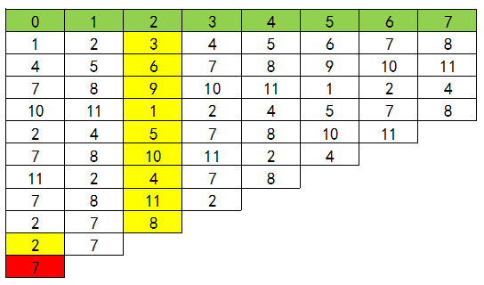

## 数学问题

<!-- TOC -->

- [数学问题](#数学问题)
  - [C++ int型负数除法取余问题](#c-int型负数除法取余问题)
  - [公倍数与公因数](#公倍数与公因数)
  - [质数](#质数)
  - [C++ 中使用随机数](#c-中使用随机数)
  - [蓄水池算法](#蓄水池算法)
  - [约瑟夫环](#约瑟夫环)

<!-- /TOC -->

### C++ int型负数除法取余问题

除法，不管是正数还是负数都是向 0 取整的：10 / 4 = 2, 10 / (-4) = -2

负数取余，通过取模来判定

\|小\| % \|大\| = \|小\| 符号同前    \|大\| % \|小\| = \|余\| 符号同前

3%4 = 3 ； -3%4 = -3 ； -3%-4 = -3 ； 3%-4 = 3；

5%3 = 2 ； 5%-3 = 2  ；-5%-3 = -2 ； -5%3 = -2；

浮点数转化为 int 整形时，小数部分会被省略，注意不是四舍五入

```c++
#include <iostream>
using namespace std;
     
int main(int argc,char** argv)
{
  int a = 8.5;
  cout << a << endl;// 输出 8
  cin.get();
  return 0;
}
```

记住这一点即可解决 C/C++ 的大部分情况。取余运算时首先全取绝对值进行计算，再进行符号的判断。

### 公倍数与公因数

辗转相除法又名广义欧几里得除法，是用来求解两个数的最大公约数的最佳算法之一。

算法原理：若 a 除以 b 的余数为 r , 则有 (a , b) = (b ,r)（(a,b)表示 a 和 b 的最大公约数）

例：169 和 48 最大公约数求解过程

169 = 48 * 3 + 25 —— (169 , 48) = (48 , 25)

48 = 25 * 1 + 13 ——(48 , 25) = (25 , 13)

25 = 13 * 1 + 12 ——(25 , 13) = (13 , 12)

13 = 12 * 1 + 1 ——(13 , 12) = (12 , 1)

12 = 1 * 12  + 0 ——(12 , 1 ) = (1 , 0)

故最大公约数为 1。

利用辗转相除法,我们可以很方便地求得两个数的最大公因数(greatest common divisor, gcd);将两个数相乘再除以最大公因数即可得到最小公倍数(least common multiple, lcm)。

```c++
int gcd(int a, int b) {
  return b == 0 ? a : gcd(b, a % b);
}
int lcm(int a, int b) {
  return (a * b) / gcd(a, b);
}
```

进一步地，,我们也可以通过扩展欧几里得算法(extended gcd)在求得 a 和 b 最大公因数的同时,也得到它们的系数 x 和 y,从而使 ax + by = gcd(a, b)。

```c++
int xGCD(int a, int b, int &x, int &y) {
  if (!b) {
    x = 1, y = 0;
  }
  int x1, y1, gcd = xGCD(b, a%b, x1, y1);
  x = x1, y = x1 - (a / b) * y1;
  return gcd;
}
```

### 质数

质数又称素数,指的是指在大于 1 的自然数中，除了 1 和它本身以外不再有其他因数的自然数。**值得注意的是,每一个数都可以分解成质数的乘积，并且最小的质数是 2。**

埃拉托斯特尼筛法(Sieve of Eratosthenes，简称埃氏筛法)是非常常用的,判断一个整数是否是质数的方法。其原理也十分易懂:从 1 到 n 遍历,假设当前遍历到 m,则把所有小于 n 的、且是 m 的倍数的整数标为和数;遍历完成后,没有被标为和数的数字即为质数。

### C++ 中使用随机数

C/C++中生成随机数需要用到两个函数：rand() 函数和 srand() 函数，C/C++ 中没有生成在一定范围内的随机数的内置函数，不过我们可以利用前边的两个函数来实现生成在一定范围内的随机数。

**rand() 函数**

该函数是一个随机发生器，返回一个随机数值，范围在 [0, RAND_MAX] 之间。RAND_MAX 定义在 stdlib.h 头文件中，C++ 中可以使用 cstdlib 头文件。

```c++
#include <iostream>
#include <cstdlib>
using namespace std;

int main()
{
  cout << "RAND_MAX:" << RAND_MAX << endl;
  for (int i = 0; i < 5; i++)
    cout << rand() << endl;
}
```

RAND_MAX 为 2<sup>15</sup> - 1。

*rand()产生的是伪随机数，每次执行的结果是相同的。即上面的程序每次运行结果都一样。*

**srand() 函数**

为了避免每次生成固定的随机数，引进 srand() 函数。该函数的功能是初始化随机数发生器，同样在头文件 cstdlib 中。

```c++
// 用来设置 rand() 产生随机数时的随机种子，参数 seed 必须是整数，如果每次 seed 设置都相同，rand() 产生的随机数同样
srand(unsigned int seed);
```

我们可使用 `srand((unsigned)time(NULL))` 的方法来产生不同的随机种子。需要引入头文件 time.h 

```c++
#include <iostream>
#include <cstdlib>
#include <time.h>
using namespace std;
 
int main()
{
  cout <<"RAND_MAX:"<< RAND_MAX << endl;
  // time(NULL) 是指返回从 1970 年 1.1日午夜 0 点到现在的秒数
  srand((unsigned)time(NULL));
  for (int i = 0; i < 5; i++)
    cout << rand() << endl;
}
```

**产生指定范围内的随机数**

要产生指定范围内的随机数，可以先使用 rand() 函数产生一个 \[0,RAND_MAX\] 范围内的随机数，然后在变换到指定范围内。 

产生 \[a, b) 的随机数，可以使用 (rand() % (b-a))+a;
产生 \[a, b\] 的随机数，可以使用 (rand() % (b-a+1))+a;
产生 (a, b\] 的随机数，可以使用 (rand() % (b-a))+a+1;

通用公式：`a + rand() % n`；其中：a 为范围起始位置，n 为整数的范围。

产生\[0,1\]的浮点数，可以使用 rand()/double(RAND_MAX);

### 蓄水池算法

给定一个数据流，数据流长度 N 很大，且 N 直到处理完所有数据之前都不可知，请问如何在只遍历一遍数据（O(N)）的情况下，能够随机选取出m个不重复的数据。

这个场景强调了 3 件事：

1. 数据流长度N很大且不可知，所以不能一次性存入内存。
2. 时间复杂度为O(N)。
3. 随机选取m个数，每个数被选中的概率为 m/N。

算法思路大致如下：

1. 如果接收的数据量小于m，则依次放入蓄水池；
2. 当接收到第i个数据时，i >= m，在\[0, i\]范围内取以随机数d，若d的落在[0, m-1]范围内，则用接收到的第i个数据替换蓄水池中的第d个数据；
3. 重复步骤2。

下面是该算法的推导验证，假设数据开始编号为1：

第i个接收到的数据最后能够留在蓄水池中的概率=第i个数据进入过蓄水池的概率 x **之后第i个数据不被替换的概率（第i+1到第N次处理数据都不会被替换）。**

1. 当i<=m时，数据直接放进蓄水池，所以第i个数据进入过蓄水池的概率=1。
2. 当i>m时，在\[1,i\]内选取随机数d，如果d<=m，则使用第i个数据替换蓄水池中第d个数据，因此第i个数据进入过蓄水池的概率=m/i。
3. 当i<=m时，程序从接收到第m+1个数据时开始执行替换操作，第m+1次处理会替换池中数据的为m/(m+1)，会替换掉第i个数据的概率为1/m，则第m+1次处理替换掉第i个数据的概率为(m/(m+1))x(1/m)=1/(m+1)，不被替换的概率为1-1/(m+1)=m/(m+1)。依次，第m+2次处理不替换掉第i个数据概率为(m+1)/(m+2)...第N次处理不替换掉第i个数据的概率为(N-1)/N。所以，之后第i个数据不被替换的概率=m/(m+1)x(m+1)/(m+2)...(N-1)/N=m/N。
4. 当i>m时，程序从接收到第i+1个数据时开始有可能替换第i个数据。则参考上述第3点（推理过程一样，自己推推），之后第i个数据不被替换的概率=i/N。
5. 结合第1点和第3点可知，当i<=m时，第i个接收到的数据最后留在蓄水池中的概率=1xm/N=m/N。结合第2点和第4点可知，当i>m时，第i个接收到的数据留在蓄水池中的概率=m/ixi/N=m/N。综上所述，每个数据最后被选中留在蓄水池中的概率为m/N。

这个算法建立在统计学的基础上，很巧妙地获得了“m/N”这个概率。

### 约瑟夫环

n 个人围成一圈，第一个人从 1 开始报数，报 M 的将被杀掉，下一个人接着从 1 开始报。如此反复，最后剩下一个，求最后的胜利者。例如只有三个人，把他们叫做 A、B、C，他们围成一圈，从 A 开始报数，假设报 2 的人被杀掉。

- 首先 A 开始报数，他报 1。侥幸逃过一劫。
- 然后轮到 B 报数，他报 2。非常惨，他被杀了
- C 接着从 1 开始报数
- 接着轮到 A 报数，他报 2。也被杀死了。
- 最终胜利者是 C

递推公式如下：

$$
f(N, M)=(f(N-1, M)+M) \% N
$$

- f(N, M) 表示 N 个人报数，每报到 M 时杀掉那个人，最终胜利者的编号

- f(N−1,M) 表示，N-1 个人报数，每报到 M 时杀掉那个人，最终胜利者的编号

下面我们不用字母表示每一个人，而用数字。

$$
1、2、3、4、5、6、7、8、9、10、11
$$

表示 11 个人，他们先排成一排，假设每报到 3 的人被杀掉。(N = 11, M = 3)

下图表示这一过程:



将上面表格的每一行看成数组，这个公式描述的是：幸存者在这一轮的下标位置(其中绿色一行表示下标位置)

最终得到 f(11, 3) = 6

问题一：假设我们已经知道 11 个人时，胜利者的下标位置为 6。那下一轮 10 个人时，胜利者的下标位置为多少？

答：第一轮删掉编号为 3 的人后，之后的人都往前面移动了 3 位，胜利这也往前移动了 3 位，所以他的下标位置由 6 变成 3。

问题二：假设我们已经知道 10 个人时，胜利者的下标位置为 3。那下一轮 11 个人时，胜利者的下标位置为多少？

答：这个问题可以看做是上一个问题的逆向过程，大家都往后移动 3 位置，所以 f(11, 3) = f(10, 3) + 3, 不过有可能数组会越界，所以最后摸上当前人数的个数，f(11, 3) = (f(10, 3) + 3) \% 3

可以看出每杀掉一个人，下一个人成为头，相当于把数组向前移动 M 位。若已知 N-1 个人时，胜利者的下标位置位 f(N−1, M) 则 N 个人的时候，就是往后移动 M 位（因为有可能数组越界，超过的部分会被接到头上，所以还要模 N），即 f(N, M)=(f(N-1, M)+M) \% N
